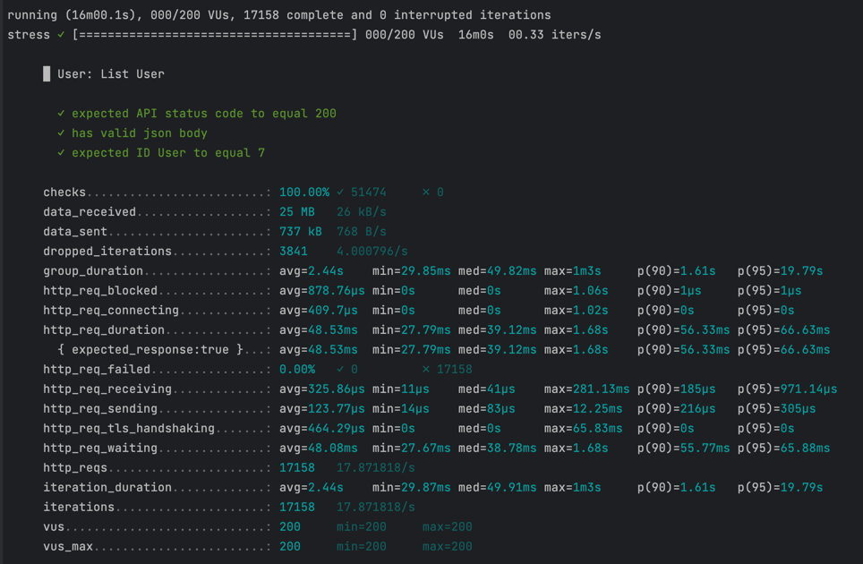

# LEARN_K6

first, you can install from docs :
https://k6.io/docs/get-started/installation/

#### how to run:

```
1. npm install
2. k6 run -e STAGE=dev test/file.js (change name file js in folder test)
```
*result* :
